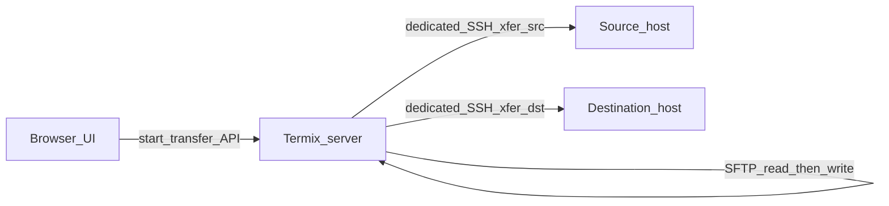

# Host-to-host file transfer

This document describes the host-to-host copy/move feature. It is intended for operators and contributors. Direct host-to-host routing via SSH tunnels is **not implemented**; that is documented under [Future work](#future-work-direct-routing-via-tunnels).

## Overview

Host-to-host transfer copies or moves files from one SSH host to another through the **Termix server** as a relay. The UI lives in **File Manager**: right-click files or folders and choose **Copy to host…** or **Move to host…**.

Compared to copying via your laptop (`scp -3` or `ssh one 'cat …' | ssh two 'cat …'`), Termix keeps the job on the server so transfers continue if you close the browser, and you get integrated progress, cancel, retry, and cleanup.

Data for remote-to-remote paths **always passes through the Termix process** (pipelined SFTP buffers, or a tar archive stream). There is no source→destination SSH tunnel for file bytes today.

## Prerequisites

1. **Two hosts** with File Manager enabled, saved in Host Manager.
2. **Both hosts reachable from the Termix server** on SSH (each host’s jump hosts and SOCKS5 proxy chain apply to the **Termix→host** connection, not host→host).
3. **File Manager open** on the source host (browse session connected). The destination host should show **Ready** in the transfer dialog; if it shows authentication required, open File Manager on that host once first.
4. For **multi-file or folder** transfers, pick a **destination directory** (not a file path).

The dialog shows a reminder: _“Both hosts must be reachable from the Termix server. Direct host-to-host routing is not supported.”_

## Using the UI

### Start a transfer

1. Open File Manager on the **source** host.
2. Select one or more files or folders.
3. Right-click → **Copy to host…** or **Move to host…** (sidebar tree supports the same context menu).
4. In the dialog:
   - Choose **destination host** (other connected file-manager hosts).
   - Set **destination path** (type a path or use **Browse destination folders**).
   - Optionally pick a **recent destination** (collapsed by default).
   - For multi-item transfers, choose **transfer method** (Auto / Tar archive / Per-file SFTP); a preview explains what Auto will pick.
   - Pin folders with **Add to shortcuts** (per-destination host; uses normal file-manager shortcuts, not a separate favourites list).
5. Confirm **Copy** or **Move**.

### During transfer

- A **progress toast** shows phase (compressing, transferring, extracting), bytes, speed, and **Cancel**.
- **Transfer monitor** (desktop, when authenticated) picks up active transfers started in another tab or window.
- Large **single files** use segmented SFTP (256 MiB segments) with **2 parallel lanes** by default (separate dedicated SSH session pairs per lane). The toast can show total speed and lane count when multiple lanes are active.

### After completion or failure

| Outcome       | What happens                                                                                                     |
| ------------- | ---------------------------------------------------------------------------------------------------------------- |
| **Success**   | Toast success; destination path saved to **recent destinations** for that source host; file manager can refresh. |
| **Partial**   | Some paths failed; toast lists failed paths; source may be kept on move.                                         |
| **Error**     | Toast with **Retry** when partial data on destination allows resume.                                             |
| **Cancelled** | Toast with optional **Clean up destination** to remove partial files.                                            |

**Move** deletes source files only after a successful full transfer (same as copy, then source delete). Cancelled or partial moves may leave files on both sides.

### Metrics

On success, expanded timing details can include: prepare destination, compress (tar), per-hop throughput (source→server, server→dest), extract, source delete, total duration.

## Transfer methods

| Method                   | When used                                                                           | Behavior                                                                                                     |
| ------------------------ | ----------------------------------------------------------------------------------- | ------------------------------------------------------------------------------------------------------------ |
| **Stream (single file)** | Exactly one file, copy or move                                                      | Pipelined SFTP read on source → write on destination; segmented above 32 MiB; parallel lanes for throughput. |
| **Tar archive**          | Multi-file/folder when Auto or user selects Tar, and both sides are Unix with `tar` | `tar -czf` on source → one archive streamed through Termix → `tar -xzf` on destination.                      |
| **Per-file SFTP**        | Windows involved, tar unavailable, or Auto chooses it                               | Each file copied sequentially over SFTP through Termix.                                                      |

**Auto** heuristics (see `src/backend/ssh/transfer-routing.ts`) consider file count, total size, largest file, and compressibility (e.g. many small files → tar; large incompressible sets → per-file SFTP).

**Method preview** is locked for the current source path set until you change Auto/Tar/Per-file preference, so changing only the destination host does not re-scan the source.

## Architecture (implementation)

| Component                                                                                                                 | Role                                                                         |
| ------------------------------------------------------------------------------------------------------------------------- | ---------------------------------------------------------------------------- |
| [`src/backend/ssh/host-transfer.ts`](../src/backend/ssh/host-transfer.ts)                                                 | Transfer engine: sessions, SFTP pipeline, tar path, retry, cancel, progress. |
| [`src/backend/ssh/file-manager.ts`](../src/backend/ssh/file-manager.ts)                                                   | HTTP routes, `openDedicatedTransferSession`, jump/SOCKS connect.             |
| [`src/backend/ssh/transfer-routing.ts`](../src/backend/ssh/transfer-routing.ts)                                           | Tar vs per-file SFTP selection.                                              |
| [`src/backend/ssh/transfer-paths.ts`](../src/backend/ssh/transfer-paths.ts)                                               | Path normalization (Unix/Windows).                                           |
| [`src/ui/.../TransferToHostDialog.tsx`](../src/ui/desktop/apps/features/file-manager/components/TransferToHostDialog.tsx) | Transfer dialog.                                                             |
| [`src/ui/.../transferProgressMonitor.tsx`](../src/ui/desktop/apps/features/file-manager/transferProgressMonitor.tsx)      | Toasts, cancel, retry, cleanup.                                              |
| [`src/ui/.../TransferMonitor.tsx`](../src/ui/desktop/apps/features/file-manager/TransferMonitor.tsx)                      | Global active-transfer polling.                                              |

**Sessions:** Browse sessions identify hosts. Each transfer opens **dedicated** SSH sessions (`xfer:{transferId}:src` / `:dst`) so browsing and transfers do not share channels. Parallel lanes add `xfer:{transferId}:src:pN` / `:dst:pN`.

**Special case:** If the destination host is the **same machine as Termix** (local SSH endpoint), writes use the local filesystem via `fastGet` instead of dest SFTP; data still originates from the remote source through Termix.

**Persistence:** Recent destinations are stored in `transfer_recent` (per user, per source host). Folder shortcuts use `file_manager_shortcuts` on the destination host.

## HTTP API (file manager service)

| Endpoint                                                 | Purpose                                                                                                                                                                    |
| -------------------------------------------------------- | -------------------------------------------------------------------------------------------------------------------------------------------------------------------------- |
| `POST /ssh/file_manager/ssh/transferMethodPreview`       | Scan source; return resolved tar vs item_sftp and reason.                                                                                                                  |
| `POST /ssh/file_manager/ssh/transferToHost`              | Start transfer; body includes `sourceSessionId`, `destSessionId`, `sourcePaths`, `destPath`, `move`, `methodPreference`, optional `parallelSegmentCount` (1–8, default 2). |
| `GET /ssh/file_manager/ssh/transferStatus/:transferId`   | Poll progress.                                                                                                                                                             |
| `GET /ssh/file_manager/ssh/activeTransfers`              | List running transfers for user.                                                                                                                                           |
| `POST /ssh/file_manager/ssh/transferCancel/:transferId`  | Request cancel.                                                                                                                                                            |
| `POST /ssh/file_manager/ssh/transferCleanup/:transferId` | Remove partial destination artifacts after cancel/failure.                                                                                                                 |
| `POST /ssh/file_manager/ssh/transferRetry/:transferId`   | Retry with same snapshot (resume when possible).                                                                                                                           |

Database (main API): `GET/POST /host/transfer/recent` for recent destinations.

## Reliability features

- **Resume:** Destination file size is probed; SFTP write opens with resume when a partial file exists (per segment on large files).
- **Retry:** Reconnects dedicated sessions; segment-level and full-copy retries with backoff; fresh SSH pairs after repeated failures (lane reset).
- **Stall detection:** ~45 s without progress on a segment; hung transfer/reconnect probing on status polls.
- **Cancel:** Aborts in-flight SFTP; user can clean up destination paths that were created or partially written.
- **Overlap guard:** Refuses transfer when source and destination paths overlap in a destructive way.

## Limitations

1. **No direct host-to-host data path** — Termix must reach **both** hosts independently (with each host’s jump/proxy settings).
2. **Not the same as S2S SSH tunnels** — Tunnels in Host Manager forward TCP ports; they do not carry file-manager transfers today.
3. **Throughput** — Remote-to-remote speed is bounded by Termix CPU/RAM and min(Termix↔source, Termix↔dest) links; very large files on a small Termix box may be slower than `scp -3` from a powerful desktop.
4. **Parallel lanes** — Writes are out of order on disk; fine for copy, not for playing media from a partially written file. Default is 2 lanes; UI may not expose lane count (API default applies).
5. **Tar** — Requires `tar` on both Unix hosts; temporary archive under `/tmp` on source during transfer.
6. **Windows** — Tar path disabled; per-file SFTP only for Windows endpoints.
7. **Jump hosts on S2S tunnels** — Server-to-server **tunnel** connect does not use jump hosts; only transfer/browse SSH does. A host reachable only via jump may work for transfer but not as an S2S tunnel source until tunnel code is aligned.

## Troubleshooting

| Symptom                               | Things to check                                                                                            |
| ------------------------------------- | ---------------------------------------------------------------------------------------------------------- |
| No destination hosts listed           | Open File Manager on another host; ensure host has File Manager enabled.                                   |
| Destination “Authentication required” | Connect File Manager on that host once in this session.                                                    |
| Transfer fails immediately            | SSH from Termix to both hosts (firewall, jump host, SOCKS5, credentials).                                  |
| Slow speed                            | Termix link to slower side; try off-peak; for single huge files, parallel lanes help if CPU/network allow. |
| Stuck progress                        | Wait for stall/reconnect; cancel and retry; check server logs for `host_transfer` / `transfer_ssh_*`.      |
| Partial files after cancel            | Use **Clean up destination** in the toast.                                                                 |
| 28 GB / 25 GB style progress          | Usually parallel progress accounting; status polls use destination size probes.                            |

## Comparison to manual `scp` between remotes

See [Unix & Linux: scp from one remote server to another](https://unix.stackexchange.com/questions/85292/scp-from-one-remote-server-to-another-remote-server). Naive `scp one:file two:file` runs **from the first host** and fails unless that host can SSH to the second. `scp -3` relays through your workstation. **Termix relay** is analogous to `scp -3` through the **Termix server**, with richer lifecycle management, not analogous to direct `ssh source 'scp … dest'`.

---

## Future work: direct routing via tunnels

The following are **planned / discussed** enhancements, not shipped in the current build. They build on existing **S2S SSH tunnels** (`src/backend/ssh/tunnel.ts`), which already connect **source → endpoint** using `forwardOut` from the source host to the endpoint’s SSH port.

### Why tunnels matter

Many homelabs have a destination that is **only reachable from another host** (e.g. NAS on LAN behind a Pi), while Termix runs elsewhere. Today that destination cannot receive a dedicated `xfer:dst` session from Termix even if an S2S tunnel from Pi → NAS is configured and working.

### Possible routes (future)

| Route                                   | Termix SSH legs | Data path                   | Benefit vs today                                                                         |
| --------------------------------------- | --------------- | --------------------------- | ---------------------------------------------------------------------------------------- |
| **Relay (current)**                     | 2               | Termix buffers SFTP         | Works when both hosts reachable from Termix.                                             |
| **Tunnel-bridged SFTP**                 | 1 (+ bridge)    | Still through Termix memory | Dest reached via source `forwardOut`; fixes reachability; reuses most of current engine. |
| **Direct remote (rsync/scp on source)** | 1 (control)     | **Source → dest** bytes     | Best throughput; Termix orchestrates `rsync`/`scp` on source when forward + tools allow. |

### Integration ideas (not implemented)

1. **`transfer-bridge` module** — Shared `forwardOut` probe and `connectDestThroughSource` (extracted from tunnel code); lookup matching `tunnel_connections` on the source host record.
2. **Route resolver** — Auto-select relay vs bridged vs direct; expose route in method preview (“via Termix” vs “direct host-to-host”).
3. **Reuse active S2S tunnel** — If Host Manager tunnel source→dest is already connected, reuse `endpointClient` instead of opening a second bridge.
4. **Jump hosts on S2S tunnel source** — Align tunnel connect with file-manager jump chains so tunnel and transfer eligibility match.
5. **Fallback** — Always fall back to current relay when probe or remote `rsync` fails (Windows, missing tools, forwarding denied).

### What would be preserved

Cancel, partial cleanup, retry/resume (rsync `--partial` on direct path; existing SFTP segment resume on relay/bridged), dedicated sessions, transfer monitor, recent destinations, folder shortcuts, and tar/per-file method selection (with direct-path variants for multi-file).

### References

- Internal plan: `.cursor/plans/host-to-host_direct_transfer_*.plan.md` (if present in your checkout).
- Tunnel implementation: [`src/backend/ssh/tunnel.ts`](../src/backend/ssh/tunnel.ts) — `connectEndpointThroughSource`, `establishManagedS2STunnel`.
- Transfer engine: [`src/backend/ssh/host-transfer.ts`](../src/backend/ssh/host-transfer.ts).

---
