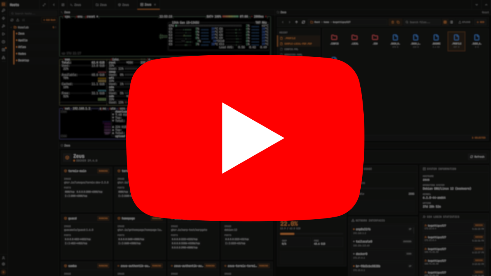

<div align="center">


<h1>Termix</h1>

<p>Gestion SSH autoalojada y acceso a escritorio remoto</p>

<p>
  <a href="../README.md">English</a> ·
  <a href="README-CN.md">中文</a> ·
  <a href="README-JA.md">日本語</a> ·
  <a href="README-KO.md">한국어</a> ·
  <a href="README-FR.md">Français</a> ·
  <a href="README-DE.md">Deutsch</a> ·
  Español ·
  <a href="README-PT.md">Português</a> ·
  <a href="README-RU.md">Русский</a> ·
  <a href="README-AR.md">العربية</a> ·
  <a href="README-HI.md">हिन्दी</a> ·
  <a href="README-TR.md">Türkçe</a> ·
  <a href="README-VI.md">Tiếng Việt</a> ·
  <a href="README-IT.md">Italiano</a>
</p>

<p>
  
  
  
  <a href="https://discord.gg/jVQGdvHDrf"></a>
</p>

<br />


<br />
<br />

<p>
  
  <br />
  <sub>Logrado el 1 de septiembre de 2025</sub>
</p>

</div>

<br />

## Descripcion General

Termix es una plataforma de gestion de servidores todo en uno, de codigo abierto, siempre gratuita y autoalojada. Proporciona una solucion multiplataforma para gestionar sus servidores e infraestructura a traves de una interfaz unica e intuitiva. Termix ofrece acceso a terminal SSH, control de escritorio remoto (RDP, VNC, Telnet), capacidades de tuneles SSH, gestion remota de archivos SSH y muchas otras herramientas. Termix es la alternativa perfecta, gratuita y autoalojada a Termius, disponible para todas las plataformas.

<br />

## Caracteristicas

<table>
<tr>
<td width="50%" valign="top">

**Acceso a Terminal SSH:**
Terminal completo con soporte de pantalla dividida (hasta 4 paneles) con un sistema de pestanas similar al navegador. Incluye soporte para personalizar el terminal incluyendo temas comunes de terminal, fuentes y otros componentes.

</td>
<td width="50%" valign="top">

**Acceso a Escritorio Remoto:**
Soporte RDP, VNC y Telnet a traves del navegador con personalizacion completa y pantalla dividida.

</td>
</tr>
<tr>
<td width="50%" valign="top">

**Gestion de Tuneles SSH:**
Cree y gestione tuneles SSH de servidor a servidor con reconexion automatica, monitoreo de estado y reenvio local, remoto o dinamico SOCKS. La configuracion de tuneles de cliente de escritorio a servidor se almacena localmente por instalacion de escritorio; los snapshots de presets C2S opcionales pueden guardarse en el servidor, renombrarse, cargarse o eliminarse para mover una configuracion de tunel local entre clientes.

</td>
<td width="50%" valign="top">

**Gestor Remoto de Archivos:**
Gestione archivos directamente en servidores remotos con soporte para visualizar y editar codigo, imagenes, audio y video. Suba, descargue, renombre, elimine y mueva archivos sin problemas con soporte sudo.

</td>
</tr>
<tr>
<td width="50%" valign="top">

**Gestion de Docker:**
Inicie, detenga, pause, elimine contenedores. Vea estadisticas de contenedores. Controle contenedores usando el terminal docker exec. No fue creado para reemplazar Portainer o Dockge, sino para simplemente gestionar sus contenedores en lugar de crearlos.

</td>
<td width="50%" valign="top">

**Gestor de Hosts SSH:**
Guarde, organice y gestione sus conexiones SSH con etiquetas y carpetas, y guarde facilmente informacion de inicio de sesion reutilizable con la capacidad de automatizar el despliegue de claves SSH.

</td>
</tr>
<tr>
<td width="50%" valign="top">

**Estadisticas del Servidor:**
Vea el uso de CPU, memoria y disco junto con red, tiempo de actividad, informacion del sistema, firewall, monitor de puertos en la mayoria de los servidores basados en Linux.

</td>
<td width="50%" valign="top">

**Autenticacion de Usuarios:**
Gestion segura de usuarios con controles de administrador y soporte para OIDC (con control de acceso) y 2FA (TOTP). Vea sesiones activas de usuarios en todas las plataformas y revoque permisos. Vincule sus cuentas OIDC/Locales entre si.

</td>
</tr>
<tr>
<td width="50%" valign="top">

**RBAC:**
Cree roles y comparta hosts entre usuarios/roles.

</td>
<td width="50%" valign="top">

**Cifrado de Base de Datos:**
Backend almacenado como archivos de base de datos SQLite cifrados. Consulte la [documentacion](https://docs.termix.site/security) para mas informacion.

</td>
</tr>
<tr>
<td width="50%" valign="top">

**Grafico de Red:**
Personalice su Dashboard para visualizar su homelab basado en sus conexiones SSH con soporte de estado.

</td>
<td width="50%" valign="top">

**Herramientas SSH:**
Cree fragmentos de comandos reutilizables que se ejecutan con un solo clic. Ejecute un comando simultaneamente en multiples terminales abiertos.

</td>
</tr>
<tr>
<td width="50%" valign="top">

**Pestanas Persistentes:**
Las sesiones SSH y pestanas permanecen abiertas entre dispositivos/actualizaciones si esta habilitado en el perfil de usuario.

</td>
<td width="50%" valign="top">

**Idiomas:**
Soporte integrado para aproximadamente 30 idiomas (gestionado por [Crowdin](https://docs.termix.site/translations)).

</td>
</tr>
</table>

<br />

<details>
<summary><b>Mas caracteristicas</b></summary>
<br />

- **Dashboard** - Vea la informacion del servidor de un vistazo en su dashboard
- **Claves API** - Cree claves API con ambito de usuario y fechas de vencimiento para usar en automatizacion/CI
- **Exportacion/Importacion de Datos** - Exporte e importe hosts SSH, credenciales y datos del gestor de archivos
- **Configuracion Automatica de SSL** - Generacion y gestion integrada de certificados SSL con redirecciones HTTPS
- **Interfaz Moderna** - Interfaz limpia compatible con escritorio/movil construida con React, Tailwind CSS y Shadcn. Elija entre muchos temas de UI diferentes, incluyendo claro, oscuro, Dracula, etc. Use rutas URL para abrir cualquier conexion en pantalla completa.
- **Historial de Comandos** - Autocompletado y visualizacion de comandos SSH ejecutados anteriormente
- **Conexion Rapida** - Conectese a un servidor sin necesidad de guardar los datos de conexion
- **Paleta de Comandos** - Pulse dos veces la tecla Shift izquierda para acceder rapidamente a las conexiones SSH con su teclado
- **SSH Rico en Funciones** - Soporta jump hosts, Warpgate, conexiones basadas en TOTP, SOCKS5, verificacion de clave de host, autocompletado de contrasenas, [OPKSSH](https://github.com/openpubkey/opkssh), tmux, port knocking, etc.

</details>

<br />

## Soporte de Plataformas

<table align="center">
<tr>
<th align="center">Plataforma</th>
<th align="center">Distribucion</th>
</tr>
<tr>
<td align="center"><b>Web</b></td>
<td>Cualquier navegador moderno (Chrome, Safari, Firefox) · Soporte PWA</td>
</tr>
<tr>
<td align="center"><b>Windows</b> <sub>x64/ia32</sub></td>
<td>Portable · Instalador MSI · Chocolatey</td>
</tr>
<tr>
<td align="center"><b>Linux</b> <sub>x64/ia32</sub></td>
<td>Portable · AUR · AppImage · Deb · Flatpak</td>
</tr>
<tr>
<td align="center"><b>macOS</b> <sub>x64/ia32, v12.0+</sub></td>
<td>Apple App Store · DMG · Homebrew</td>
</tr>
<tr>
<td align="center"><b>iOS/iPadOS</b> <sub>v15.1+</sub></td>
<td>Apple App Store · IPA</td>
</tr>
<tr>
<td align="center"><b>Android</b> <sub>v7.0+</sub></td>
<td>Google Play Store · APK</td>
</tr>
</table>

<br />

## Instalacion

Visite la [documentacion](https://docs.termix.site/install) de Termix para mas informacion sobre como instalar Termix en todas las plataformas. De lo contrario, vea un archivo Docker Compose de ejemplo aqui (puede omitir guacd y la red si no planea usar funciones de escritorio remoto):

```yaml
services:
  termix:
    image: ghcr.io/lukegus/termix:latest
    container_name: termix
    restart: unless-stopped
    ports:
      - "8080:8080"
    volumes:
      - termix-data:/app/data
    environment:
      PORT: "8080"
    depends_on:
      - guacd
    networks:
      - termix-net

  guacd:
    image: guacamole/guacd:1.6.0
    container_name: guacd
    restart: unless-stopped
    ports:
      - "4822:4822"
    networks:
      - termix-net

volumes:
  termix-data:
    driver: local

networks:
  termix-net:
    driver: bridge
```

<br />

## Capturas de Pantalla

<div align="center">

<br />

[](https://www.youtube.com/@TermixSSH/videos)

<sub>Ver resúmenes de actualizaciones en YouTube</sub>

<br />
<br />

<table>
<tr>
<td></td>
<td></td>
</tr>
<tr>
<td></td>
<td></td>
</tr>
<tr>
<td></td>
<td></td>
</tr>
<tr>
<td></td>
<td></td>
</tr>
<tr>
<td></td>
<td></td>
</tr>
<tr>
<td></td>
<td></td>
</tr>
<tr>
<td></td>
<td></td>
</tr>
</table>

<sub>Algunos videos e imagenes pueden estar desactualizados o no mostrar perfectamente las caracteristicas.</sub>

</div>

<br />

## Caracteristicas Planeadas

Consulte [Proyectos](https://github.com/orgs/Termix-SSH/projects/2) para todas las caracteristicas planeadas. Si desea contribuir, consulte [Contribuir](https://github.com/Termix-SSH/Termix/blob/main/CONTRIBUTING.md).

<br />

## Patrocinadores

<div align="center">

<br />

<a href="https://www.digitalocean.com/">
  
</a>
&nbsp;&nbsp;&nbsp;
<a href="https://crowdin.com/">
  
</a>
&nbsp;&nbsp;&nbsp;
<a href="https://www.blacksmith.sh/">
  
</a>
&nbsp;&nbsp;&nbsp;
<a href="https://www.cloudflare.com/">
  
</a>
&nbsp;&nbsp;&nbsp;
<a href="https://tailscale.com/">
  
</a>
&nbsp;&nbsp;&nbsp;
<a href="https://akamai.com/">
  
</a>
&nbsp;&nbsp;&nbsp;
<a href="https://aws.amazon.com/">
  
</a>

</div>

<br />

## Soporte

Si necesita ayuda o desea solicitar una funcion para Termix, visite la pagina de [Issues](https://github.com/Termix-SSH/Support/issues), inicie sesion y pulse `New Issue`. Por favor, sea lo mas detallado posible en su reporte, preferiblemente escrito en ingles. Tambien puede unirse al servidor de [Discord](https://discord.gg/jVQGdvHDrf) y visitar el canal de soporte, sin embargo, los tiempos de respuesta pueden ser mas largos.

<br />

## Licencia

Distribuido bajo la Licencia Apache Version 2.0. Consulte `LICENSE` para mas informacion.
